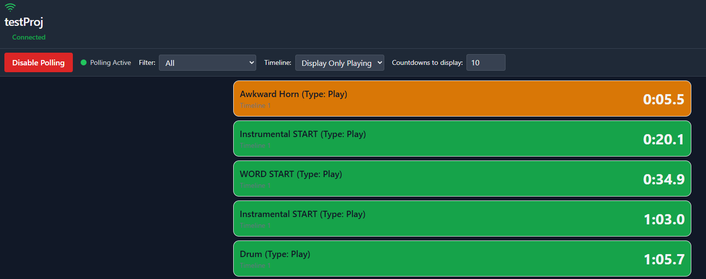

# Pixera_Countdowns

During Live Production events, there are many hard cues to capture on camera (e.g., drum solos, lead switches, etc.). The goal of this application is to increase production quality by providing real-time countdowns to selected critical cues.

The architecture consists of a single **backend script** polling Pixera for cue data, while **multiple frontends** consume that data to display synchronized countdowns.

> **Credit:** This application was primarily "vibe-coded" using Cursor and other AI agents. While I performed extensive modification and cleaning, Cursor handled the heavy lifting for the initial logic.

## 📸 Preview

---

## 📋 Table of Contents
* [Requirements](#-requirements)
* [Setup & Installation](#-setup--installation)
* [How to Run](#-how-to-run)
* [Pixera Configuration](#-pixera-configuration)
* [Polling Strategy](#-pixera-polling-discussion)
* [Front End Operation](#-front-end-operation)
* [Known Behaviors](#-notes)

---

## 🛠 Requirements
* **Pixera** (The free version is fine. See the [Pixera](#pixera-configuration) section for setup.)
* **Docker**

---

## ⚙️ Setup & Installation
1. Install Pixera.
3. **Configure Environment**: 
   * Open `docker-compose.yml`.
   * Update the `PIXERA_HOST` variable to the actual IP address of your Pixera machine.
   * Update the `PIXERA_PORT` variable (default is `4023`).

---

## 🚀 How to Run

### Production Mode
1. Execute the `Start_PixCountdowns_Prod` file.
2. Open your browser to the URL indicated (default: `http://localhost:3000`).
3. To stop the backend, use the Docker UI to stop the `Pixera_Countdowns` container.
4. **Updating**: If you modify source files, run `Update_PixCountdowns_Prod` to rebuild the Docker image.

### Development Mode
* Use the `Start_Pixcountdowns_Dev` command to enable **hot-reload**. 
* This allows you to modify source files on the fly; Docker will watch the original files directly rather than building a static image.

---

## 🎥 Pixera Configuration
Refer to the [Pixera API Quick Start Guide](https://help.pixera.one/api/api-quick-start-guide) for deep integration.

* **Protocol**: You must select the **HTTP/TCP(dl)** Protocol. 
* **Port**: Match the port to your script default (recommended: `4023`).
* **StreamDeck Note**: If Pixera is connected to a StreamDeck, you must also provide a standard HTTP/TCP connection, as StreamDeck does not support the `(dl)` option.
* **Cues**: The script identifies all Play cues. Place a play cue at the exact timestamp you want the timer to target.
* **Filtering**: Prefix cue names with `A_` to enable the "critical cues" filter in the frontend.
* **Notes**: Any text in the "Cue Notes" field will be displayed alongside the countdown.

---

## ⏱ Pixera Polling Discussion
To avoid overwhelming Pixera with API calls, the system uses an on/off polling toggle. This ensures the backend only polls during active show windows. For safety, a **6-hour auto-timeout** is implemented in case the polling is not disabled manually.

### Polling Methods Considered
| Strategy | Status | Reason |
| :--- | :--- | :--- |
| **Search + Fast** | ❌ | Unnecessary complexity given the manual on/off switch. |
| **Emitted Signals** | ❌ | `setMonitoringEventMode` is currently unreliable/partially functional in Pixera.  Even if it did work, it would probably cause too much network traffic/machine load since it emits on every change. |
| **100ms Polling** | ✅ | Provides single-decimal accuracy without excessive overhead. |

### Technical Detail
Two concurrent polling loops run when enabled:
1. **Project/Timeline (10s):** Checks for structural changes using `getTimelines` and `getTimelineInfosAsJsonString`.
2. **Cue Status (100ms):** Tracks real-time playhead and cue positions via `getCueInfosAsJsonString`.

---

## 🖥 Front End Operation
1. **Enable Polling**: Initializes the connection and syncs the current playlist.
2. **Timeline Selection**: Allows the user to manually select a specific timeline to monitor.
3. **Cue Filter**: Toggle to isolate cues prefixed with `A_`.
4. **Timers**: Displays the next 10 upcoming cues. Note: The frontend does not "count"—it re-syncs to the backend data every 100ms for total accuracy.

---

## 📝 Notes
* **Visibility**: If the playhead passes all available cues, the timeline display will clear.
* **Timeline State**: Timers may behave unexpectedly if the timeline is paused or stopped.
* **Jump Cues**: The application does not currently "look ahead" through jump cues to other timelines.

**Example Logic:**
* **Timeline 1**: Cue 1 → Cue 2 (**Jump to T2-Cue1**) → Cue 3
* **Timeline 2**: Cue 1 → Cue 2 → Cue 3

The timer will show T1 Cues 1, 2, and 3. Once the jump occurs, it will refresh to show T2 Cues 2 and 3. *Support for cross-timeline jump forecasting could be added based on interest.*